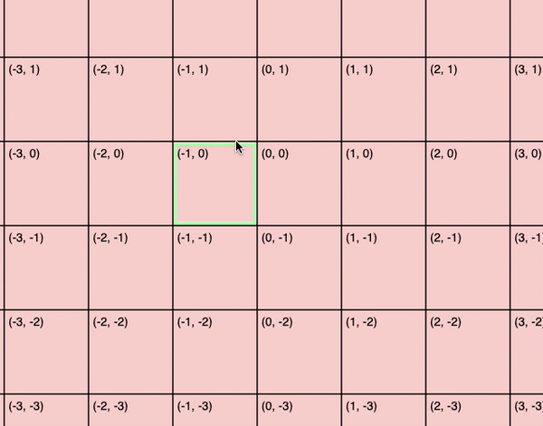
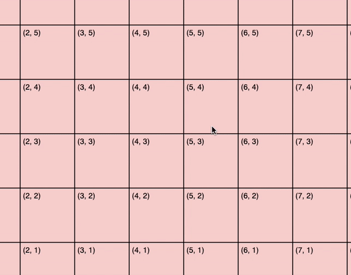

june 22, 2020

* [part 1](part1.md)
* **part 2**

### [sound and color](https://www.youtube.com/watch?v=faG8RiaANek)

now that i have a basic camera framework that's pretty functional, it's time to be able to control the individual blocks themselves. first, i want to 'select' a block when i click on it with my mouse. [going from a canvas position to a block coordinate](https://github.com/joon-ko/songplane/blob/311de3/static/js/index.ts#L82) took a bit of reasoning and math, but it wasn't too bad.

now for sound and color. currently, all blocks that are drawn are not actually stored anywhere as actual blocks: in other words, they're dummy blocks. but if we want to associate a sound and color to a block, we need to start storing them, so i made a map with block positions as the key and a [`Block`](https://github.com/joon-ko/songplane/blob/311de3/static/js/block.ts#L10) object as the value. the `Block` class is an abstraction that draws itself with a canvas context and plays a sound with an [audio context](https://developer.mozilla.org/en-US/docs/Web/API/Web_Audio_API). i hardcoded two different sounds and colors to the Q and W keys for now, but eventually users should be able to select a large range of sounds and colors. pressing the Enter key plays a block's sound.

#### a detour into the Web Audio API

i think the Web Audio API is really good for something that is built right into most modern browsers nowadays. i took a class called *interactive music systems* recently that was all about building... well, interactive music systems, using python. the python audio library we used was pretty much written by the instructor, eran egozy, who was a co-founder of Harmonix (the company that made guitar hero!!). what's interesting is that the built-in Web Audio API has most of the features for manipulating and controlling audio that eran had to write himself in python.

in this API, audio is routed through `AudioNode` objects, of which there are several types. there are audio sources, like [`OscillatorNode`](https://developer.mozilla.org/en-US/docs/Web/API/OscillatorNode), which begins a route, and produces waveforms, and there's the audio destination, which is the end of a route. there's also nodes that take the output of a node as input and manipulates that input in some way: the most common example is the [`GainNode`](https://developer.mozilla.org/en-US/docs/Web/API/GainNode), which takes its input and scales the volume by some factor, serving as volume control. there are a lot of cool node types other than `GainNode`, however, that can transform audio in powerful ways, like applying a stereo pan or a low-pass filter. connecting audio nodes together is as easy as calling `AudioNode.connect()`!

for songplane, each Block object instantiates and connects its own audio nodes on initialization, which you can see in the Block class's [constructor](https://github.com/joon-ko/songplane/blob/311de3/static/js/block.ts#L20).

### showing neighboring blocks, and a 'song indicator'

if we want to make songs, we need a way for blocks to be connected unidirectionally to another, so that when we start a song at a particular block, it knows where to go next by checking all the blocks it's connected to. eventually, i want to make an expansive collection of different ways you can control song flow, but a simple rule for now is that you can only connect a block with its immediate neighbors (including diagonals).

first i wrote a function that returns a list of neighbor block positions given a block position. i then highlighted neighboring blocks (relative to the currently selected block) in purple when holding the C key (C for 'connect'?). the flow i imagine is to click a block, hold c, then click a neighboring block (colored purple) to connect the selected block with the neighboring block. for now, it's enough to just display the neighboring blocks, and i'll implement actually connecting them later.

lastly, i made a 'song indicator' in the form of a black circle that fades over time, which will represent the visual indicator of where the song is currently located.

